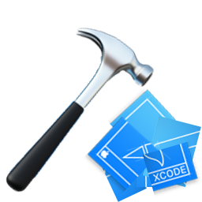
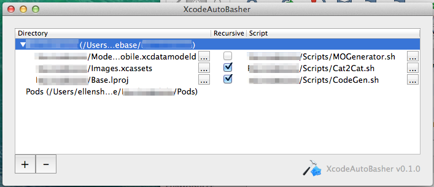

XcodeAutoBasher
=================

#What

An Xcode plugin to run a given script any time a given folder or its children have changes. 

#Why

I use several small convenience utilities that are run via shell script. I've previously been running these manually by creating build targets for each of them, but realized I could tie each of them to changes in a specific folder. 

My idea was to create something that could do all of the following: 

- Watch the `.xcassets` folder recursively and run a script that fires off [Cat2Cat](http://github.com/vokalinteractive/Cat2Cat) whenever an `imageset` is added, removed, or renamed. 
- Watch the folder where all my Storyboards live and run a script that fires off [objc-identifierconstants](https://github.com/square/objc-codegenutils) when one of my storyboards is changed. 
- Watch my `.xcdatamodeld` and fire off [MOGenerator](https://github.com/rentzsch/mogenerator) anytime a change to the data model is saved. 

The product of that thought process is `XcodeAutoBasher`. 

#Where
Installable via the [Alcatraz](http://alcatraz.io) package manager. 

If you hate convenience: 

1. Check out or download a .zip of the code. 
2. Build and run. 
3. Restart Xcode. 

#How

After installing, once you restart Xcode, there will be a new option under the `Window` menu for `XcodeAutoBasher`. Open that up, and you will see a window showing any currently running projects. Select a currently open project, then:  

1. Click the plus button to add a row to watch a script. *(Note: You may have to open the flippy triangle next to the project to see the row you added.)*

2. Click the `...` button on the first column to bring up a file selection dialog where you can pick what file or folder you wish to observe.

3. Check the checkbox if you want to watch this folder recursively (ie, if you want to watch all of its children as well).

4. Click the `...` button on the third column to bring up a file selection dialog where you can pick the script you want to run when a change is detected. 

5. A file will be added to the same folder as your `.xcodeproj` file, `[your project name].XcAB.plist`, which will store relative paths to each script within your project. This allows the `plist` files to be committed to version control so anyone opening the project can have this already set up. 

###Notes on Script Setup
- Your scripts should be within the same directory structure as your `.xcodeproj` file, since this plugin will be looking for children of the `.xcodeproj`'s parent folder. This allows `XcodeAutoBasher` to only watch currently open projects, as well as allowing anyone who checks out your project to have `XcodeAutoBasher` work immediately.

-  Note that scripts outside this directory's children will be run, but on a shared project they will not work well since they will be saved with an absolute path, so they will only work on your machine. 

- You should verify your script runs via the Terminal *before* you try to add it to `XcodeAutoBasher`—this will significantly narrow down your "Is this plugin screwing up or is it me?" troubleshooting time.  

- Scripts should be executable on their own—that is, they should have the executable bit set (`chmod +x ...`) and the first line should be something like `#!/bin/bash` or `#!/usr/bin/env python` (a "[shebang](http://en.wikipedia.org/wiki/Shebang_(Unix))").

- To see if a script is executable, cd into its directory and run `ls -la`. If the `x` bit is not set, run `chmod +x [filename]`, and then run `ls -la` again to verify the bit is now set. 

#When
RIGHT NOW!!!

#Who
Initially a [VOKAL](http://www.vokalinteractive.com) Hack Days Fall 2014 Project by [Ellen Shapiro](http://github.com/designatednerd). Massively improved by the desktop programming skillz of [Isaac](http://github.com/ilg) [Greenspan](http://github.com/vokal-isaac). 

Open source contributions are encouraged!

#//TODO: 
- Animate smashing of Xcode logo, because that would be awesome. 
- ??? File an issue or put up a pull request!